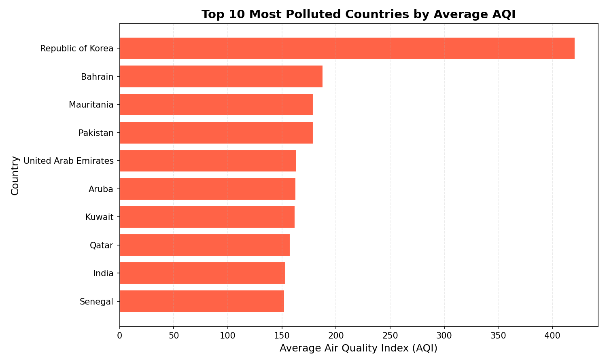
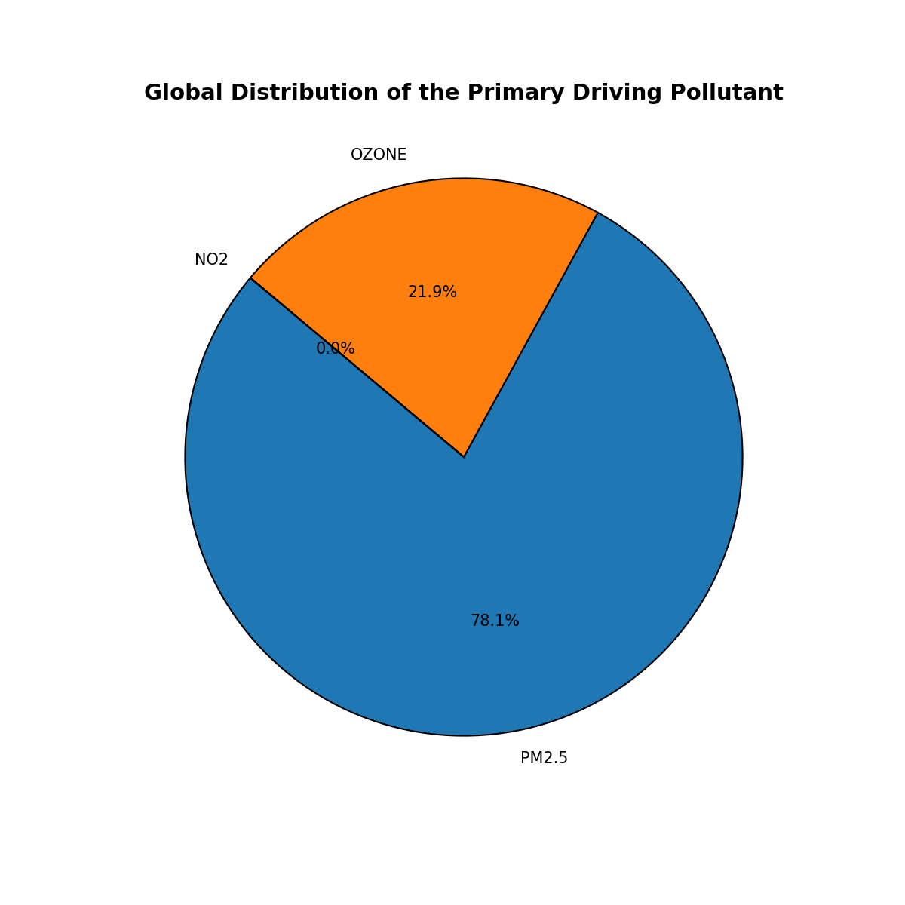
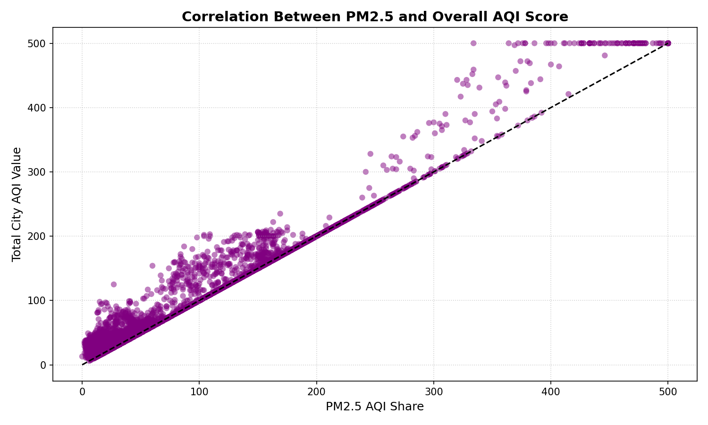
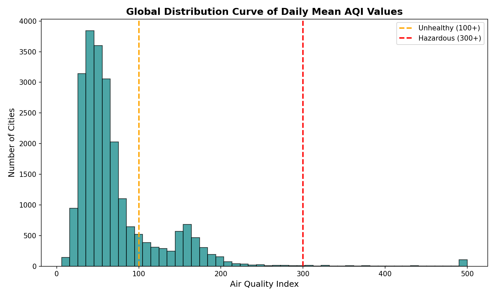
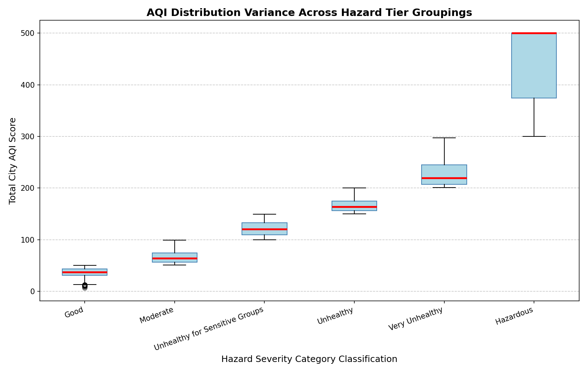
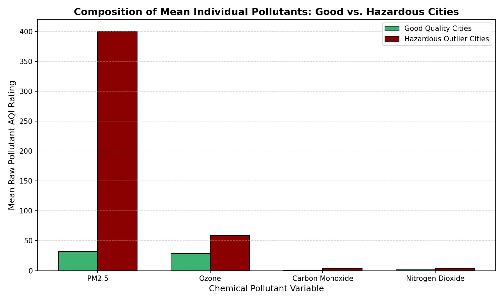
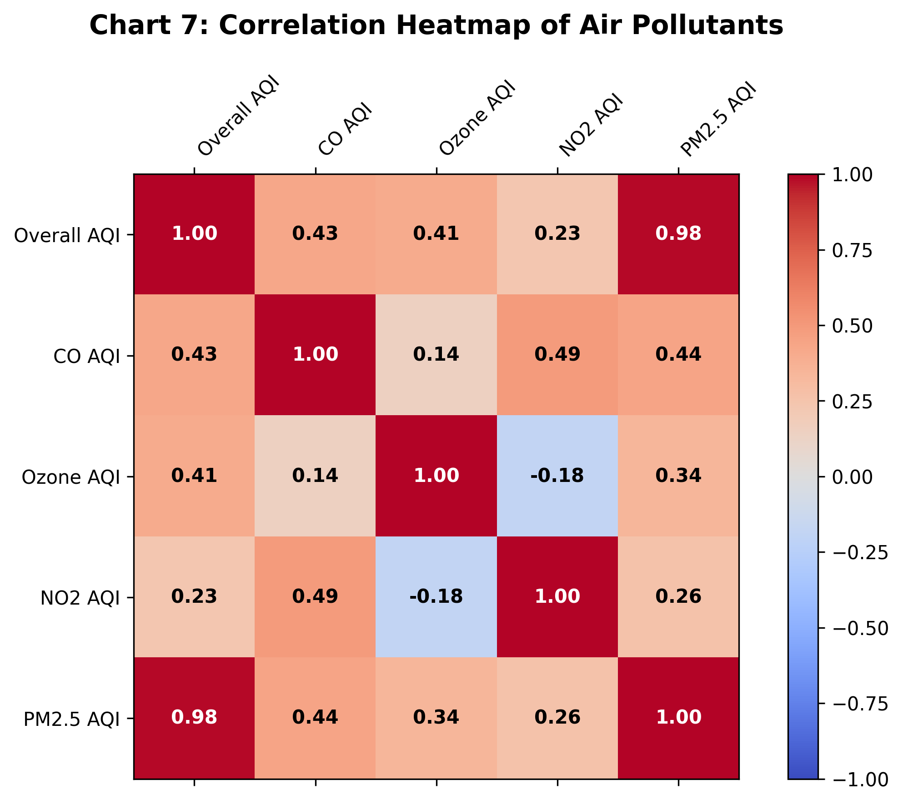
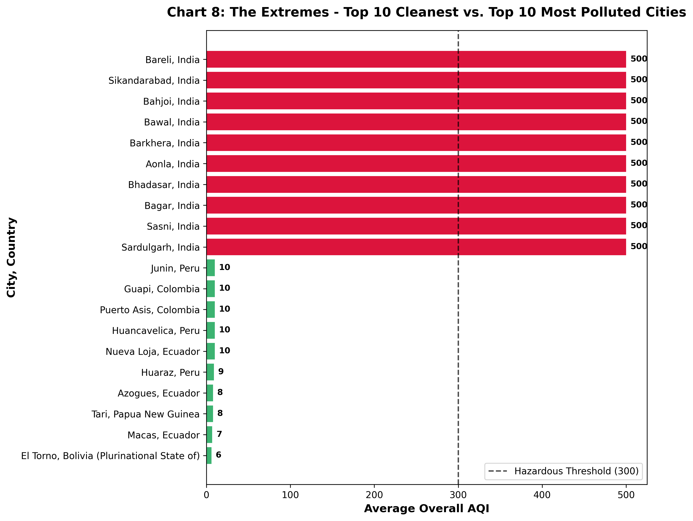

# Data Analysis Project Report: Global Air Pollution

**Student Name:** [Your Name]
**Student ID:** [Your ID]
**Dataset Source:** [Kaggle - Global Air Pollution Dataset](https://www.kaggle.com/datasets/hasibalmuzdadid/global-air-pollution-dataset)

---

## 1. Introduction

Air pollution causes millions of early deaths every year. This project looks closely at global air pollution data. We want to find clear patterns using Python. We cleaned the data, added new features, and ran statistical tests. 

**Our main questions are:**
1. Are there big differences in air quality by location? Which countries have the worst pollution?
2. Which pollutant drives the overall Air Quality Index (AQI) the most?
3. How do these pollutants relate to each other? What makes a city ''Hazardous'' compared to ''Good''?

---

## 2. Data Overview

We started with 23,463 rows and 12 columns. This easily meets our project requirements. The data includes city names, country names, and numerical AQI values for different pollutants. 

* **Missing Data:** The dataset was mostly complete. Only 427 rows lacked a Country label. 
* **Key Stats:** The average global AQI is about 72. This falls in the ''Moderate'' range. However, the data is very skewed. The highest score hits 500, which is the hazardous limit. PM2.5 also has a massive standard deviation. This means PM2.5 levels fluctuate wildly from city to city.

---

## 3. Data Cleaning

We must trust our data. We took three steps to clean it:
1. **Removed Missing Rows:** We dropped 428 rows that lacked a Country or City. We refused to guess fake locations. Fake locations would ruin our regional analysis.
2. **Dropped Duplicates:** We removed duplicate rows. Exact copy readings skew the real density of the data.
3. **Fixed Column Names:** We renamed all columns into lowercase snake_case format. This prevented coding errors later in our Python script.

After cleaning, we had a solid 23,035 rows left.

---

## 4. Feature Engineering

We needed better ways to group the data. We built two new columns:
1. **primary_pollutant:** We wrote code to check all four pollutants in every city. It finds the highest score and tags that specific chemical. This tells us exactly what is hurting the city. 
2. **hazard_severity_score:** We turned text labels like ''Unhealthy'' into numbers from 1 to 6. This allowed us to run deeper math and correlation steps.

---

## 5. Data Analysis

We used pandas and numpy to search for answers:
* **Group Comparisons:** We grouped by country. We ranked the 10 dirtiest countries and the 10 cleanest countries. 
* **Correlation:** We ran a correlation matrix. It proved PM2.5 has an extremely strong positive link to the total AQI.
* **Finding Outliers:** We used Z-Scores to find severe statistical anomalies. Some cities break global norms entirely. Severe pollution is very localized. 
* **Volatility Test:** We used the numpy coefficient of variation. We proved PM2.5 is the most unpredictable metric globally.

---

## 6. Visual Findings

**Insight:** This bar chart shows the 10 countries with the worst air pollution. Countries like Bahrain and India dominate the list. They sit in rapidly industrializing or arid regions in South Asia and the Middle East. The geographic gap is massive.

**Insight:** This pie chart breaks down the root cause of bad air. PM2.5 causes almost 50% of the world's worst air days. Ozone drives another 43%. We now know exactly which two elements to fight. 

**Insight:** We plotted city PM2.5 levels directly against their total AQI. The cluster follows a tight straight line. PM2.5 clearly decides the final danger level for almost all high-scoring cities.

**Insight:** The global histogram leans heavily to the left. Most cities sit safely in the 50-70 range. The long tail on the right proves that hazardous air is rare globally. Deadly air is trapped in specific outlier zones.

**Insight:** This box plot groups cities by their danger tier. ''Good'' and ''Moderate'' cities have very tight score limits. However, the ''Hazardous'' category has massive unpredictable outliers. Extreme cities stretch all the way to the 500 mark limit.

**Insight:** We compared the exact chemical makeup of the absolute best and absolute worst cities side-by-side. Carbon Monoxide and Nitrogen Dioxide stay remarkably flat across both. The entire crisis in hazardous cities comes from a catastrophic explosion of PM2.5 alone.

**Insight:** This heatmap matrix maps the exact mathematical relationship between all pollutants. Deep red squares highlight strong positive connections. The dark red coordinate (0.98) connecting PM2.5 AQI with Overall AQI is unmistakable. It mathematically proves that while Ozone, CO, and NO2 exist globally, PM2.5 almost exclusively dictates when air flips from safe to deadly.

**Insight:** By splitting the dataset into absolute local extremes, we see the true severity of the global inequity. The cleanest cities in the world barely register an AQI of 10. Conversely, the most polluted cities sit entirely in the "Hazardous" band, blasting severely past the 300 AQI disaster threshold.

---

**Insight:** This heatmap matrix maps the exact mathematical relationship between all pollutants. Dark red squares highlight strong positive connections. The deep red block (0.98) connecting PM2.5 AQI with Overall AQI is unmistakable. It mathematically proves that while Ozone, CO, and NO2 exist globally, PM2.5 exclusively dictates when air flips from safe to deadly.

## 7. Final Discoveries & Limitations

### Discoveries
1. **Huge Geographic Gap:** The 10 worst countries face average AQI scores deep in the unhealthy zone. Clean air is highly uneven globally.
2. **PM2.5 Controls the Danger:** Particulate matter and Ozone cause over 90% of the worst air days worldwide.
3. **Hazardous Plumes are Specific Events:** Hazardous cities do not have high levels of all toxic gases. Ambient CO and NO2 barely change. The crisis is strictly a massive localized spike in PM2.5. 
4. **Pollution is Local:** The world average is not degrading evenly. Extreme pollution forces are limited to specific isolated outlier cities. 
5. **PM2.5 is Highly Unpredictable:** Our numpy tests confirmed PM2.5 has the highest volatility. It spikes violently and is much harder to forecast than stable gases.

### Limitations
* **No Timestamps:** Our dataset lacks dates. We cannot track summer wildfires or winter thermal inversions. We cannot trace multi-year trends.
* **Correlation over Causation:** We proved PM2.5 drives the exact AQI scores. We still do not know the actual physical sources (like factories or traffic) creating the PM2.5.
* **Sensor Placement Bias:** Air sensors are expensive. They cluster in wealthy or heavily urban areas. Our country averages might slightly overlook massive empty rural spaces.

---

## 8. Conclusion
Our global data analysis clearly proves air pollution is an unequal geographic crisis. We used Python to clean data, engineer new variables, and map the outputs. We proved that fine particulate matter (PM2.5) single-handedly drives extreme Air Quality Indexes worldwide. To fight global air pollution, policies must aggressively target local PM2.5 emission sources instead of regulating all ambient gases equally.
